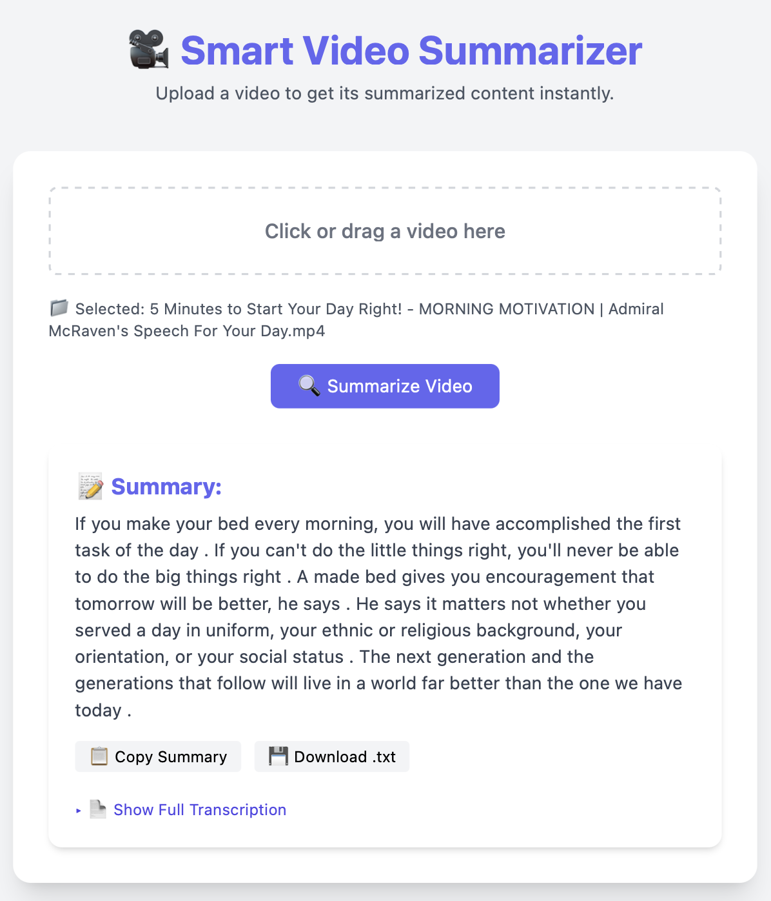

## Video-Summarizer
An AI-powered tool that lets users upload a video and instantly get a clean, concise summary and transcription. Powered by OpenAI Whisper and Hugging Face Transformers, it's perfect for quickly understanding the key points in long videos.

---
##Demo


---
## Features

- Upload and analyze video files like mp-4 or mov
- Auto-transcription using Whisper
- Summarization using Hugging Face’s transformers
- Copy or download the summary
- Full transcription view
- Simple and elegant UI with Tailwind CSS

---
## Technologies Used

- **Python 3.9**
- **Flask** – for the backend server
- **Flask-CORS** – to handle cross-origin requests
- **Whisper (OpenAI)** – for transcribing audio to text
- **Hugging Face Transformers** – for summarizing the transcription
- **MoviePy** – for processing the video files
- **Tailwind CSS** – for styling the frontend
- **HTML + Vanilla JavaScript** – for the interactive part

---
## Requirements

- Python 3.x
- Flask
- transformers
- openai-whisper
- moviepy
- flask-cors

---
## Installation

### Clone the repository

```bash
git clone https://github.com/Aariz1706/Video-Summarizer.git
cd smart-video-summarizer
